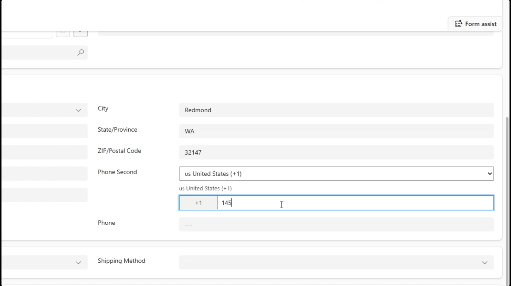

# 🇯🇴 Country Phone Formatter  
### Power Apps Component Framework (PCF) Control

A **reusable and enterprise-ready Power Apps component** for formatting phone numbers with country codes, **modern UI/UX**.

Designed for **Model-Driven Apps / Dataverse** with performance, accessibility, and localization in mind.

---

## 🎥 Preview (Inside CRM)

> Screenshots and animations captured directly from Microsoft Dynamics 365 / Dataverse forms.

###  image 1 


###  image 2 


###  image 3 


### 🎞️ Live Formatting Demo


---

## ✨ Features

### 📞 Core Functionality
- **Country Selection**
  - Dropdown with **25+ countries**
  - Middle East focus + global coverage
- **Auto-formatting**
  - Country-specific phone number formatting
- **Bi-directional Binding**
  - Syncs with Dataverse form fields
- **State Persistence**
  - Remembers user selection between sessions

---

### 🎨 UI / UX
- **Modern Design**
  - Fluent UI–inspired styling
- **Theme Awareness**
  - Auto (system / app theme)
- **Responsive Layout**
  - Full-width adaptive design
- **Accessibility**
  - Keyboard navigation
  - Screen reader friendly
- **Visual Feedback**
  - Focus states
  - Hover effects

---

## 🚀 Installation

### Prerequisites
- Power Apps (Model-Driven Apps)
- Power Apps CLI
- Node.js 14+ and npm

---

### Deployment Steps

#### 1️⃣ Build the Component
```bash
npm install
pac pcf push
npm run build
